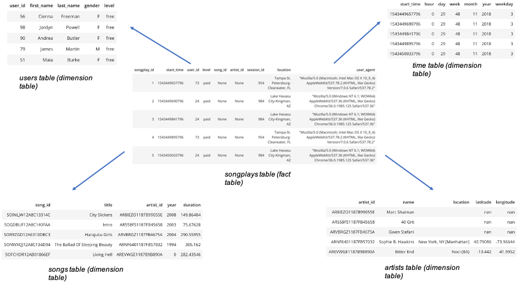

# Purpose of this database and expected analytical goals

Sparkify is a startup which owns a music streaming app, and the company wants to have a better understanding of their clients and the songs they listen to, in order to grow. 
However, the files needed for these analyses are stored in json log files, and it is difficult to do analyses with these raw files.

That's why we need to create this Redshift database to give the business analysts a tool to easily and quickly analyze the behaviours of their customers, 
so that they can know their customers better, give them a better user experience, and thus grow their business. 

With this database, we can do a lot of descriptive analysis pretty quickly like counting the number of users, their gender, how many of them are using a paid account, 
how many songs do they listen per day on average, etc... 

# Description of the database schema design and ETL pipeline

The database is designed in a star schema, which means that we have one main fact table (the songplays table) and 4 dimensions tables (users, songs, artists and time). This design is opted here because with this design, we don't need to do complicated queries to have the information we need. 

More precisely, we can quickly query the most important and interesting information on the fact table itself (without any join), and if we want some more precisions, we can join with the corresponding dimension tables to have that information (as we have 4 dimension tables, with 4 joins we can access all the available information).

Here is an illustration of the tables and the star schema : 



Regarding the ETL pipeline, we are extracting information stored in json files in S3 and we copy them into Redshift staging tables first, and we create the fact and dimensions tables by extracting data from these staging tables.

# How to create and populate the database ?

To create the database, open a terminal and change the directory to this directory.
Once you're here, run the following command :

```bash
python create_tables.py
```

This will sequentially create the staging tables and the fact and dimensions tables. Then, run the following command :

```bash
python etl.py
```

This will first load the staging tables from the files located in S3 and then insert the needed information in the fact and dimensions tables created previously.

Once the database has been created and populated correctly, we can run the queries to analyze these data.

# Detailed files description

**sql_queries.py** : python script which contains all the sql queries to create the the staging tables, the fact and dimension tables, drop the tables, copy the data located in S3 into the staging tables, and finally populate the fact and dimensions tables from data extracted from the staging tables.

**create_tables.py** : python script which connects to the Redshift database, and which uses the create_table_queries and drop_table_queries defined in the module sql_queries.py to drop the tables and create the tables.

**etl.py** : python script which connects to the Redshift database, loads the staging tables and inserts data in the fact and dimensions tables.

**dwh.dfg** : file containing the credentials to connect to the Redshift database and to read data from S3. However, this file is empty here as we should not share the AWS credentials.
